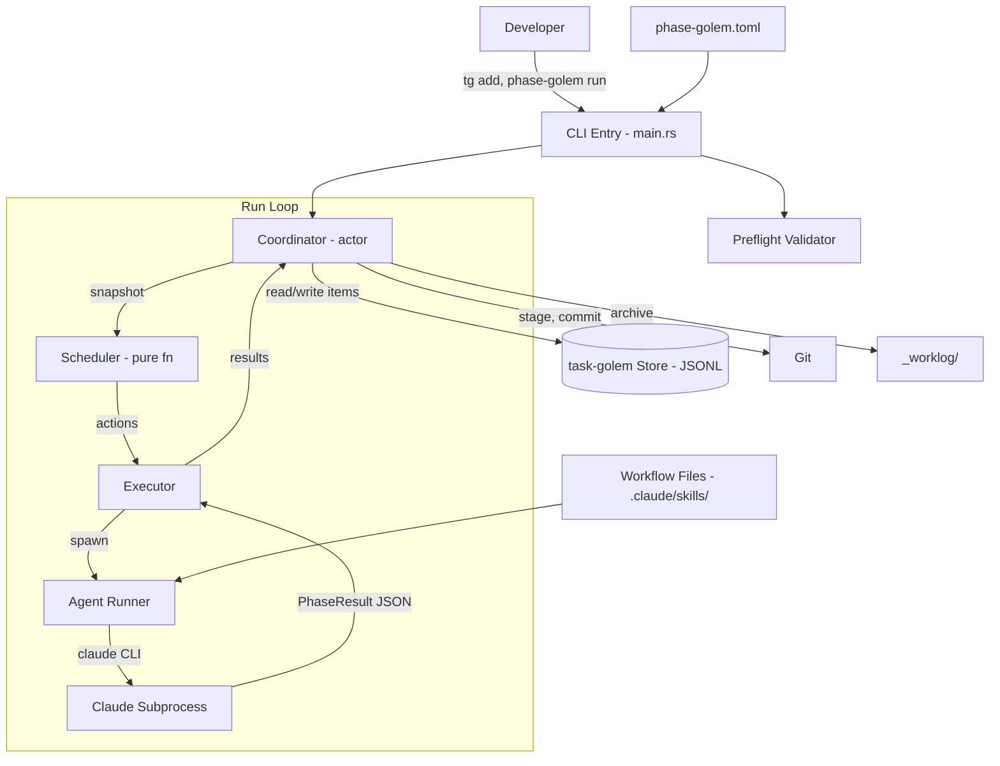

# Project Architecture: Phase Golem

_Created: 2026-02-27_
_Last Updated: 2026-02-27_

## System Purpose

Phase-golem is a general-purpose pipeline orchestrator that autonomously manages a backlog of work items and executes configurable workflow phases using CLI-based AI agents. You configure a pipeline (named phases + workflow files), add items to a backlog, and run it -- phase-golem handles triage, scheduling, agent invocation, lifecycle management, retries, and result tracking. The primary use case today is software development workflows (PRD -> design -> spec -> build -> review), but the core is pipeline-agnostic and works for any sequential, agent-driven workflow.

## Architecture Diagram

```mermaid
graph TD
    User[Developer] -->|tg add, phase-golem run| CLI[CLI Entry - main.rs]
    CLI --> Preflight[Preflight Validator]
    CLI --> Coordinator

    subgraph "Run Loop"
        Coordinator[Coordinator - actor] -->|snapshot| Scheduler[Scheduler - pure fn]
        Scheduler -->|actions| Executor
        Executor -->|spawn| Agent[Agent Runner]
        Agent -->|claude CLI| Claude[Claude Subprocess]
        Claude -->|PhaseResult JSON| Executor
        Executor -->|results| Coordinator
    end

    Coordinator -->|read/write items| TG[(task-golem Store - JSONL)]
    Coordinator -->|stage, commit| Git[Git]
    Coordinator -->|archive| Worklog[_worklog/]

    Config[phase-golem.toml] --> CLI
    Workflows[Workflow Files - .claude/skills/] --> Agent
```

## Component Summary

| Component | Responsibility | Key Dependencies |
|-----------|---------------|-----------------|
| **CLI** (`main.rs`) | Parse commands, dispatch to run/status/triage/advance/unblock | clap, config, coordinator |
| **Scheduler** (`scheduler.rs`) | Pure function: select next actions from item snapshot | None (pure, no I/O) |
| **Executor** (`executor.rs`) | Run phases: staleness checks, agent invocation, transition resolution | agent, prompt, config |
| **Coordinator** (`coordinator.rs`) | Tokio actor: serialize all item mutations, git commits, follow-up ingestion | task-golem Store, git |
| **Agent Runner** (`agent.rs`) | Spawn Claude CLI subprocesses, enforce timeouts, handle signals | tokio::process, nix |
| **Prompt Builder** (`prompt.rs`) | Construct agent prompts from item context + workflow files | filesystem (read workflows) |
| **Preflight** (`preflight.rs`) | Validate config, probe workflow files, check item consistency | config, filesystem |
| **Config** (`config.rs`) | Load and validate `phase-golem.toml` | toml, serde |
| **PgItem** (`pg_item.rs`) | Wrapper over task-golem Item with `x-pg-*` extension field accessors | task-golem types |
| **Git** (`git.rs`) | Git operations: status, staging, commit, ancestor checks | git CLI (subprocess) |

## Key Patterns

- **Pure scheduler, effectful executor** -- The scheduler is a pure function (`select_actions`) with no I/O. All side effects (subprocess spawning, git commits, state mutations) happen in the executor and coordinator. This makes scheduling logic deterministic and easy to test.
- **Actor-based coordinator** -- The coordinator receives updates over a Tokio channel, serializing all mutations to the task-golem store. This avoids concurrent write conflicts without explicit locking on the store.
- **TG-native lifecycle** -- Task-golem status, claims, dependencies, and readiness are authoritative. Phase-golem extensions store execution policy such as ownership, phase, assessments, and planned human gates, not a second lifecycle.
- **Destructive exclusion** -- Destructive phases (those that mutate shared state, e.g. code, files, external resources) run exclusively: no other phases execute concurrently. Non-destructive phases can batch. This prevents conflicts without complex coordination.
- **Staleness detection** -- Before running a destructive phase, the system verifies the prior phase's commit SHA is still an ancestor of HEAD. If a rebase invalidated it, the item blocks rather than building on stale artifacts.

## Key Flows

### Flow: Run Loop (core execution)

> The main loop that drives all autonomous work.

1. **Snapshot** -- Coordinator reads active and archived items plus task-golem's dependency evaluation under one store lock
2. **Schedule** -- Pure `select_actions()` claims TG-ready PG-owned tasks, stops at ready human gates, then selects execution for claimed tasks. It respects WIP limits, destructive exclusion, and concurrency caps.
3. **Execute** -- Claims transition `todo` to `doing` through task-golem before triage or phase execution. Phase runs spawn an agent subprocess, wait for completion, and parse the `PhaseResult` JSON.
4. **Apply** -- Coordinator applies state transitions (next phase, status change, assessment updates), ingests follow-ups as new items
5. **Commit** -- Destructive phases commit immediately; non-destructive phases batch commit together
6. **Halt check** -- Stop if: all items done/blocked, phase cap reached, circuit breaker tripped (2+ consecutive retry exhaustions), signal received, or target item finished

### Flow: Item Lifecycle

> How a work item moves from creation to completion.

1. **Created** -- Phase-golem creates a PG-owned `todo` task with a canonical UUIDv7. Bare tasks created by `tg add` remain outside PG until ownership metadata is attached.
2. **Selected** -- Task-golem evaluates dependencies. Phase-golem considers only tasks in TG's ready result.
3. **Gated or claimed** -- A ready planned human gate remains `todo` and halts the run. Other ready work is atomically claimed and becomes `doing` before execution.
4. **Executed** -- Triage and configured phases update PG execution metadata while the task remains `doing`. Failed or attempted-but-unable work becomes `blocked` with diagnostics.
5. **Completed** -- The final phase explicitly transitions the task to `done`; task-golem archives it. Parent and container statuses never roll up automatically.

### Flow: Phase Execution (single phase)

> What happens when the executor runs one phase.

1. **Staleness check** (destructive only) -- Verify prior phase commit is ancestor of HEAD
2. **Build prompt** -- Preamble (item context, autonomous notice) + skill invocation (workflow file) + output suffix (write JSON to result path)
3. **Spawn agent** -- Start `claude` subprocess in a new process group
4. **Wait** -- Monitor for completion or timeout (`phase_timeout_minutes`)
5. **Parse result** -- Read `PhaseResult` JSON, validate identity (item_id + phase match)
6. **Resolve transition** -- Determine next state: advance phase, transition status, block, or retry on failure

## Infrastructure & Deployment

- **Hosting:** Local CLI binary on developer machine
- **Build:** `cargo build --release` (also: `just build`, `just build-release`)
- **CI:** GitHub Actions -- `cargo fmt --check`, `cargo clippy -- -D warnings`, `cargo test`
- **Deploy:** Copy binary to PATH (`~/.local/bin/` or similar). No package registry yet.
- **Runtime files:** `.phase-golem/` directory for lock file and PID (gitignored)

## Cross-Cutting Concerns

- **Error Handling:** Categorized errors (`PgError`) with `is_retryable()` and `is_fatal()` methods. Retryable errors (lock timeout) retry automatically. Fatal errors (storage corruption, ID collision) halt the coordinator. Skip errors (item not found, invalid transition) log and continue.
- **Logging:** Macro-based (`log_error!`, `log_warn!`, `log_info!`, `log_debug!`) with atomic global log level. No external logging framework.
- **Mutual Exclusion:** File-based lock (`.phase-golem/phase-golem.lock`) prevents concurrent phase-golem instances. PID file for helpful error messages on stale locks.
- **Signal Handling:** SIGTERM/SIGINT set a global shutdown flag. Graceful shutdown: 5-second grace period for child processes, then SIGKILL. Global registry of child process groups for cleanup.
- **Configuration:** Single `phase-golem.toml` at project root. Validated at startup by preflight. Defaults provided for missing optional fields.

## Key Constraints & Decisions

| Decision | Rationale |
|----------|-----------|
| task-golem as lifecycle and storage backend | Avoid parallel persistence and lifecycle state. TG owns status, claims, dependencies, readiness, and archive behavior; PG metadata stays co-located with items. |
| Pure scheduler function | Deterministic scheduling is easy to test and reason about. All I/O stays in executor/coordinator. |
| Tokio actor for coordinator | Serializes mutations without explicit locks on the store. Channel-based message passing is idiomatic async Rust. |
| File-based locking | Simple mutual exclusion for a single-machine CLI. No need for distributed locks. |
| Process groups for agent cleanup | Ensures all child processes (Claude CLI and its children) are cleaned up on shutdown, not just the direct child. |
| Single destructive phase at a time | Avoids conflicts on shared state (merge conflicts for git, resource contention for other pipelines) without complex coordination. Acceptable tradeoff for single-operator use case. |

## Architectural Debt

- **Blocking git operations in async context** -- Some git operations (`git.rs`) are synchronous subprocess calls within async code. Most are wrapped in `spawn_blocking` but the pattern isn't fully consistent.
- **Config format alignment** -- Both YAML (task-golem backlog) and TOML (phase-golem config) are used. Aligning on one format would reduce cognitive overhead.
